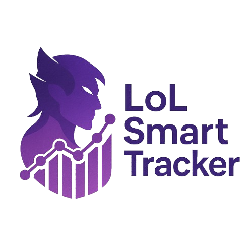

<div align="center">
  
  <h1>LoL Smart Tracker</h1>
  <p>
    <strong>Analiza tus partidas de League of Legends y recibe recomendaciones de IA para mejorar tu juego.</strong>
  </p>
  <p>
    <a href="#-acerca-del-proyecto">Acerca del Proyecto</a> •
    <a href="#-características">Características</a> •
    <a href="#-tecnologías-utilizadas">Tecnologías</a> •
    <a href="#-cómo-empezar">Cómo Empezar</a> •
    <a href="#-futuras-mejoras">Futuras Mejoras</a> •
    <a href="#-contacto">Contacto</a>
  </p>
  <br />
  Hola 👋, Soy Erik Santana Montelongo, Backend Developer y creador de este proyecto.
</div>

---

## 🔭 Acerca del Proyecto

**LoL Smart Tracker** es una aplicación web diseñada para ayudar a los jugadores de League of Legends a visualizar su rendimiento reciente y, lo más importante, recibir recomendaciones personalizadas y análisis inteligentes generados por IA para mejorar su desempeño en el juego.

A diferencia de otros trackers que se centran en mostrar estadísticas simples, LoL Smart Tracker busca:
* Interpretar tus estadísticas con lógica e inteligencia.
* Detectar patrones en tu juego, como campeones con bajo rendimiento, fallos comunes, o baja participación en objetivos.
* Sugerir cambios adaptativos para mejorar tu estrategia general.

El sistema obtiene automáticamente las últimas partidas del usuario (actualmente configurado para analizar hasta 50, mostrando 20) a través de la API oficial de Riot Games y aplica diferentes técnicas de IA, desde análisis estadísticos avanzados hasta modelos de Machine Learning, para generar sugerencias y perspectivas únicas.

Este proyecto es una evolución en las herramientas de análisis de LoL, buscando ser una herramienta proactiva que realmente ayude a los jugadores a mejorar, ofreciendo información útil más allá de simples números.

## ✨ Características

* **Visualización de Historial de Partidas:** Muestra un resumen de tus últimas partidas (hasta 20 en la interfaz), incluyendo KDA, CS, oro, daño, objetos, hechizos, modo de juego y más.
* **Análisis del Invocador:** Presenta información de tu perfil, incluyendo nivel y rango en Solo/Duo con su emblema.
* **Recomendaciones Generales del Analista (IA - Nivel 1):**
    * Análisis de winrate general y rachas de derrotas.
    * Evaluación del rendimiento con campeones específicos (KDA y winrate).
    * Análisis de CS/minuto según el rol.
    * Evaluación de la participación en asesinatos (KP%).
    * Análisis de la puntuación de visión por minuto.
    * Identificación de métricas clave que se correlacionan con tus victorias/derrotas para campeones específicos (Análisis Estadístico Avanzado).
* **Perspectivas Clave por Campeón (IA - Árbol de Decisión):**
    * Un modelo de Machine Learning simple analiza tus partidas con tus campeones más jugados para identificar qué estadística personal parece ser el factor más influyente para tus victorias.
* **Análisis de Estilos de Juego (IA - Clustering K-Means):**
    * Un modelo de clustering agrupa tus partidas recientes en diferentes estilos de juego, intentando asignarles nombres de arquetipo y ayudándote a entender tus tendencias.
* **Predicción de Composición de Equipo (IA - RandomForest):**
    * Un modelo entrenado con datos de composiciones de equipo (recopilados en la BD local) ofrece una estimación de la probabilidad de victoria para el equipo azul en cada partida de tu historial.
    * Muestra los campeones que el modelo global considera más influyentes según los datos con los que fue entrenado.
* **Búsqueda Integrada:** Permite buscar cualquier invocador por su Riot ID#TAG directamente desde la página de resultados o la de inicio.
* **Almacenamiento de Datos:** Guarda los datos de las partidas procesadas en una base de datos SQLite local para permitir análisis más profundos y el reentrenamiento de modelos de ML a medida que se recopilan más datos.
* **Optimización con Caché:** Utiliza Flask-Caching (`FileSystemCache`) para reducir las llamadas a la API de Riot y mejorar los tiempos de carga en búsquedas repetidas.

## 🛠️ Tecnologías Utilizadas

Este proyecto se ha construido utilizando las siguientes tecnologías principales:

* **Backend:**
    * Python
    * Flask
    * Flask-SQLAlchemy
    * Flask-Caching
* **Frontend:**
    * HTML5
    * CSS3 (con [Tailwind CSS](https://tailwindcss.com/) y [Bootstrap 5](https://getbootstrap.com/))
    * JavaScript (mínimo)
* **Machine Learning:**
    * Pandas
    * NumPy
    * Scikit-learn
* **Base de Datos:**
    * SQLite
* **API:**
    * Riot Games API
* **Otros:**
    * Requests
    * python-dotenv
    * Joblib

## 🚀 Cómo Empezar

Sigue estos pasos para poner en marcha el proyecto en tu entorno local.

### Prerrequisitos

* Python 3.8 o superior
* pip (manejador de paquetes de Python)
* Una clave de API de Riot Games válida (obtenida desde el [Portal de Desarrolladores de Riot](https://developer.riotgames.com/))

### Instalación

1.  **Clona el repositorio:**
    ```bash
    git clone [https://github.com/TU_USUARIO/TU_REPOSITORIO.git](https://github.com/TU_USUARIO/TU_REPOSITORIO.git) # Reemplaza con tu URL
    cd TU_REPOSITORIO
    ```

2.  **Crea y Activa un Entorno Virtual (Recomendado):**
    ```bash
    python -m venv venv
    # En Windows:
    # venv\Scripts\activate
    # En macOS/Linux:
    # source venv/bin/activate
    ```

3.  **Instala las Dependencias:**
    ```bash
    pip install -r requirements.txt
    ```

4.  **Configura tus Variables de Entorno:**
    * Crea un archivo llamado `.env` en la raíz del proyecto.
    * Añade tu clave de API de Riot y otras configuraciones:
        ```env
        RIOT_API_KEY="RGAPI-TU_CLAVE_REAL_AQUI"
        SECRET_KEY="UNA_CLAVE_SECRETA_RANDOM_PARA_FLASK" 
        # Opcional: Configuración para la IA y API
        # RIOT_ACCOUNT_REGION="europe"
        # RIOT_PLATFORM_REGION="euw1"
        # MATCH_COUNT_FOR_AI=30 
        # MIN_GAMES_FOR_CHAMP_ML=10
        # MIN_GAMES_FOR_CLUSTERING_ML=15
        # NUM_CLUSTERS_PLAYSTYLE=3
        ```

5.  **Inicializa la Base de Datos y Entrena el Modelo (Primera Vez):**
    * Ejecuta la aplicación Flask una vez para que se cree la estructura de la base de datos (se creará una carpeta `instance` con `lol_smart_tracker.db`):
        ```bash
        python -m app.app 
        ```
        Puedes detenerla con Ctrl+C después de que se inicie.
    * Para poblar la base de datos, usa la aplicación web para buscar varios jugadores. Cuantos más, mejor.
    * Una vez que tengas datos en la BD, ejecuta el script de entrenamiento desde la raíz del proyecto:
        ```bash
        python train_composition_model.py
        ```
        Esto creará los archivos `team_composition_predictor.joblib` y `team_composition_features.joblib` (y `top_champion_influencers.json`).

6.  **Ejecuta la Aplicación Flask:**
    ```bash
    python -m app.app 
    ```
    Abre tu navegador y ve a `http://127.0.0.1:5000/`.

## 🔮 Futuras Mejoras

Este proyecto tiene mucho potencial para crecer. Algunas ideas basadas en la propuesta original: ()

* **Mejorar Precisión de Modelos de ML:** A medida que se recopilen más datos, reentrenar los modelos y experimentar con arquitecturas más complejas o ingeniería de características avanzada (ej. roles de campeones en la composición, sinergias/counters).
* **Profundizar en "IA Explicando Errores/Aciertos":** Extraer reglas más específicas de los Árboles de Decisión o usar SHAP/LIME para modelos más complejos. ()
* **Alertas y Evolución en el Tiempo:** Con datos históricos por usuario, mostrar progreso y generar alertas sobre cambios en rendimiento o estilo (tipo coach virtual). ()
* **Comparación entre Jugadores.** ()
* **Análisis de Fase de Juego:** Integrar datos de la timeline de las partidas para dar consejos específicos de early/mid/late game. ()

Enlace al Proyecto: [https://github.com/Erikzonnn/LoLSmartTracker](https://github.com/Erikzonnn/LoL-Smart-Tracker)
